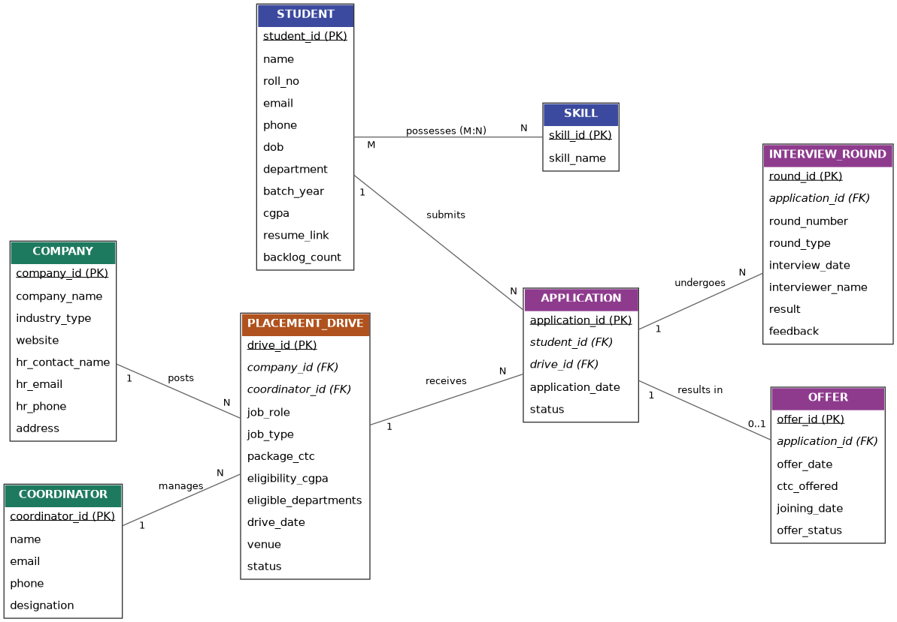
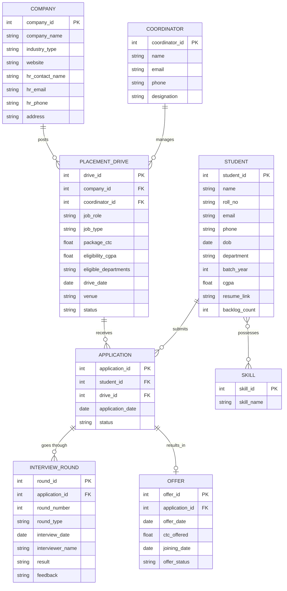

# MCA Placement Management System — ER Model



## Overview

This system tracks the full placement lifecycle for MCA students: companies visiting campus, the drives/job postings they run, student applications, interview rounds, and final offers. A placement coordinator (TPO) manages drives, and students maintain a skill profile used for eligibility matching.

## ER Diagram



## Entities

| Entity | Purpose |
|---|---|
| **Student** | An MCA student eligible to apply for placements |
| **Company** | A recruiting organization |
| **Coordinator** | Placement cell staff who manage drives |
| **Placement_Drive** | A specific hiring event/job posting run by a company |
| **Application** | Links a student to a drive they applied for |
| **Interview_Round** | One round (technical/HR/GD/aptitude) within an application's process |
| **Offer** | The outcome if an application succeeds |
| **Skill** | A skill a student can list on their profile |

## Relationships & Cardinality

| Relationship | Cardinality | Notes |
|---|---|---|
| Company → Placement_Drive | 1 : N | One company can run many drives over time |
| Coordinator → Placement_Drive | 1 : N | Each drive is managed by one coordinator |
| Student → Application | 1 : N | A student can apply to many drives |
| Placement_Drive → Application | 1 : N | A drive receives many applications |
| Application → Interview_Round | 1 : N | An application can have multiple rounds |
| Application → Offer | 1 : 0..1 | An application results in at most one offer |
| Student ↔ Skill | M : N | Resolved via a `Student_Skill` junction table (student_id, skill_id, proficiency_level) |

`Application` is intentionally modeled as its own entity (not just a join table) because it carries its own status and lifecycle (Applied → Shortlisted → Interviewed → Selected/Rejected), and both `Interview_Round` and `Offer` depend on it.

## Design Notes / Assumptions

- A student can have multiple applications across different drives, but only one application per (student, drive) pair — enforce with a unique constraint on (student_id, drive_id).
- `Offer` is separated from `Application` rather than merged in, since not every application produces one, and an offer has its own fields (CTC offered, joining date) that may differ from the drive's advertised package.
- `eligible_departments` on `Placement_Drive` is kept as a simple field here; if you need strict many-to-many eligibility rules, split it into a `Drive_Eligible_Department` junction table instead.
- Backlogs/CGPA are stored on `Student` since eligibility filtering in most systems checks these directly.

## Suggested Relational Schema Mapping

Each entity above maps 1:1 to a table with the listed attributes. The only extra table needed beyond what's diagrammed is the junction table for the M:N relationship:

```sql
Student_Skill (
    student_id INT REFERENCES Student(student_id),
    skill_id   INT REFERENCES Skill(skill_id),
    proficiency_level VARCHAR(20),
    PRIMARY KEY (student_id, skill_id)
);
```

All other foreign keys (`company_id`, `coordinator_id`, `student_id`, `drive_id`, `application_id`) are as shown in the diagram's entity attribute lists.
